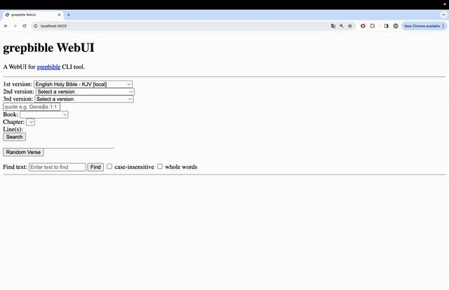

# grepbible-server

grepbible-server is a server on top of [grepbible](https://en.wikipedia.org/wiki/Bible_citation) CLI tool.

You are encouraged to use this project as a foundation or inspiration for crafting your own unique web UI built upon `grepbible` CLI tool. Whether you're looking to implement advanced features, integrate with other services, or simply experiment with new design concepts, this project is designed to be easily forkable and modifiable to suit your creative vision. Thus, although it's functional, it has rudimentary UI design on purpose, to make it easy to fork and build the design from scratch.

# Demo 

## Features

- **Full-text search**: Search for words or phrases in the whole text (`grep` experience).
- **Search Capabilities**: Look up individual verses, ranges of chapters, or specific passages across multiple translations.
- **Multiple Bible Versions**: Easily switch between different Bible translations to compare interpretations and wording.
- **Local Caching**: Bible versions are downloaded and stored locally for quick access and offline use.
- **Parallel and interleave text**: Combine text blocks from different translations.

## Self-hosting

Clone the project locally, and then run
`docker compose up .`

Alternatively, you can pull the docker's image (here on port 4628):

`docker pull axlit/grepbible-server`

and run it 

`docker run -d -p 4628:4628 --name grepbible-server axlit/grepbible-server:latest`

## Installation

To install `grepbible-server`, you need to install `grepbible` CLI tool first, `pip install grepbible` should do it, consult [this page](https://github.com/maxlit/grepbible?tab=readme-ov-file#installation)  for more details.
Then you need to install the nodeJS server app: `npm install grepbible-server`

Alternatively, you can clone this project, and run `npm start`.

## Contributing

Contributions to `grepbible-server` are welcome! Whether it's improving code, or reporting issues, or spreading the word, or financial support, your input is valuable.  

### Issues/bugs

To raise an issue, go to 'Issues' tab, and click on 'New issue'.

### Code

To contribute code:

1. Fork the repository.
2. Create a new branch for your feature or fix.
3. Commit your changes with clear, descriptive messages.
4. Push your branch and submit a pull request.

Please ensure your code adheres to the project's style and quality standards. For major changes, please open an issue first to discuss what you would like to change.

### Social

Feel free to spread the word or/and use the hashtag `#grepbible` in social media.

### Material

Feel free to buy me a coffee: 

## License

`grepbible-server` is open-source software licensed under the MIT License. See the LICENSE file for more details.